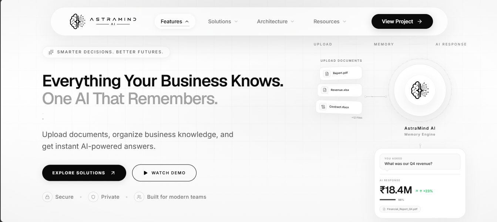
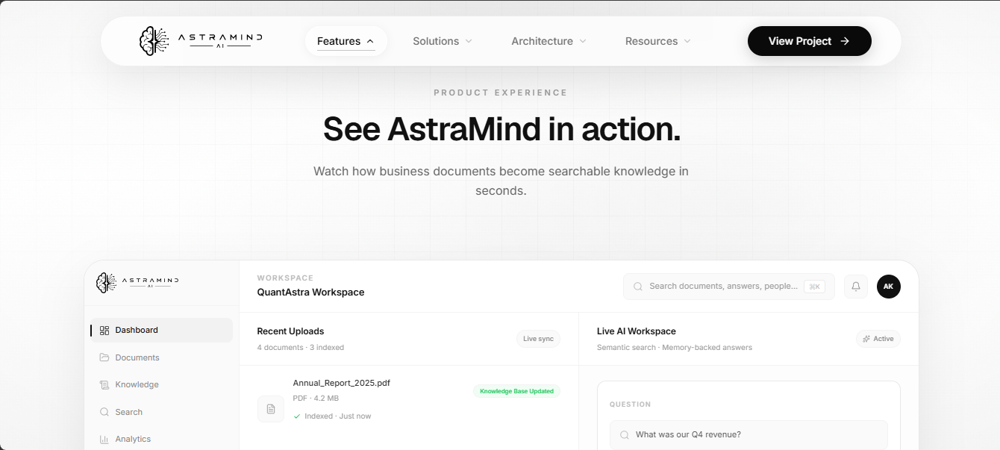
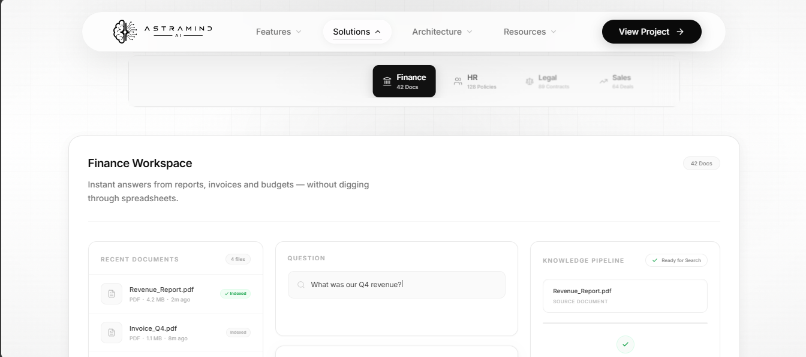
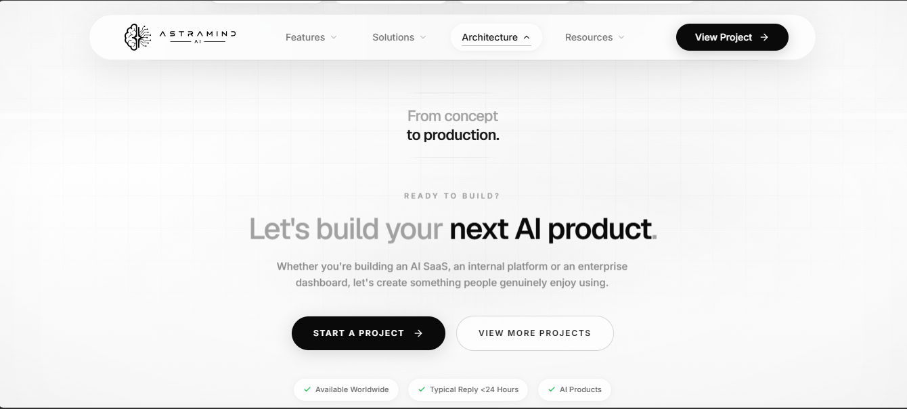

<div align="center">

# AstraMind AI

### Enterprise AI Workspace Experience

A premium AI workspace landing page crafted to showcase modern product design, immersive motion, responsive engineering, and production-ready frontend architecture.

<p>
  <a href="https://astramindai.quantastraai.in"><strong>🚀 Live Demo</strong></a> •
  <a href="https://quantastraai.in"><strong>🌐 QuantAstra Solutions</strong></a> •
  <a href="https://github.com/quantastraai"><strong>💻 GitHub</strong></a>
</p>

Built with ❤️ by **QuantAstra Solutions**

</div>

---

# Preview

> Replace the image below with your latest project screenshot.

<p align="center">
  
</p>

---

# Overview

AstraMind AI is a premium enterprise AI workspace concept designed to demonstrate how modern AI products should feel.

Instead of relying on static marketing pages, AstraMind combines storytelling, smooth interactions, premium animations, and responsive engineering to create an immersive product experience inspired by companies like **Apple, Linear, Stripe, and Vercel**.

The project showcases production-grade frontend architecture with a strong focus on performance, accessibility, scalability, and polished user experience.

---

# Highlights

- Enterprise AI SaaS Landing Page
- Interactive Product Storytelling
- AI Workspace Experience
- Dynamic Department Use Cases
- Enterprise Trust Experience
- Scroll-driven GSAP Animations
- Responsive Across All Devices
- Accessibility-first Development
- Production-ready SEO
- High-performance Frontend Architecture

---

# Tech Stack

## Frontend

- React
- TypeScript
- Vite

## Styling

- Tailwind CSS
- CSS Variables

## Animation

- GSAP
- Framer Motion

## UI

- Lucide React

## Tooling

- ESLint
- TypeScript
- Vite

---

# Screenshots

## Hero Experience

> Premium AI-first landing experience.

<p align="center">

</p>

---

## Product Showcase

> Interactive AI workspace with immersive product presentation.

<p align="center">

</p>

---

## Department Use Cases

> Multiple enterprise workflows demonstrated through dynamic UI.

<p align="center">

</p>

---

## AI Architecture

> React UI → Knowledge Engine → AI Response.

<p align="center">

</p>

---

## Final CTA

> Premium project conclusion.

<p align="center">

</p>

---

# Project Structure

```text
src
├── assets
├── components
├── hooks
├── layouts
├── lib
├── sections
├── styles
└── App.tsx

public
├── robots.txt
├── sitemap.xml
└── site.webmanifest

index.html
```

---

# Performance

Optimized for production with:

- Lazy-loaded sections
- Optimized React rendering
- requestAnimationFrame throttling
- ScrollTrigger lifecycle cleanup
- Reduced layout shifts
- Production-ready build optimization

---

# Accessibility

- Semantic HTML
- Keyboard Navigation
- Skip Navigation
- Focus-visible States
- Reduced Motion Support
- ARIA Improvements
- Screen Reader Friendly

---

# SEO

Production-ready SEO configuration includes:

- Canonical URL
- Open Graph
- Twitter Cards
- JSON-LD Schema
- robots.txt
- sitemap.xml
- Web Manifest

---

# Responsive Design

Fully optimized for:

- Desktop
- Laptop
- Tablet
- Mobile

Every section has been individually refined instead of simply scaling the desktop layout.

---

# Lighthouse Goals

| Category | Target |
|-----------|--------|
| Performance | 95+ |
| Accessibility | 100 |
| Best Practices | 100 |
| SEO | 100 |

---

# Local Development

```bash
git clone https://github.com/quantastraai/astramind-ai.git

cd astramind-ai

npm install

npm run dev
```

---

# Production Build

```bash
npm run build
```

Preview production build

```bash
npm run preview
```

---

# Design Philosophy

> **Technology should feel invisible. The experience should feel effortless.**

Every interaction, animation, transition, and layout has been carefully refined to create a premium enterprise SaaS experience.

---

# Future Roadmap

- Vendor Chunk Optimization
- AI Dashboard Expansion
- More Interactive Product Flows
- Additional Enterprise Case Studies

---

# About the Project

AstraMind AI was created as a frontend engineering showcase to demonstrate premium SaaS product design, modern interaction patterns, responsive engineering, and production-ready React architecture.

The project reflects the design quality and user experience expected from modern enterprise software.

---

# Author

**Bhavyesh Paghdar**

Founder — QuantAstra Solutions

🌐 Website  
https://quantastraai.in

🚀 Live Demo  
https://astramindai.quantastraai.in

💼 LinkedIn  
https://www.linkedin.com/in/quantastra-ai-4a0669411

💻 GitHub  
https://github.com/quantastraai

✉️ Email  
quantastraai@gmail.com

---

# License

This repository is part of my professional portfolio.

The source code is shared for demonstration purposes only and may not be copied, redistributed, or used commercially without prior permission.

---

<div align="center">

### ⭐ If you found this project interesting, consider giving it a Star.

Built with React • TypeScript • Tailwind CSS • GSAP • Framer Motion

</div>
